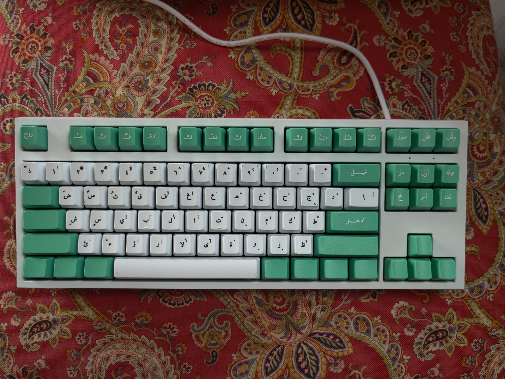
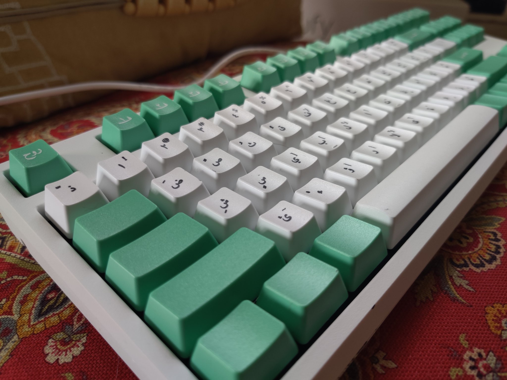
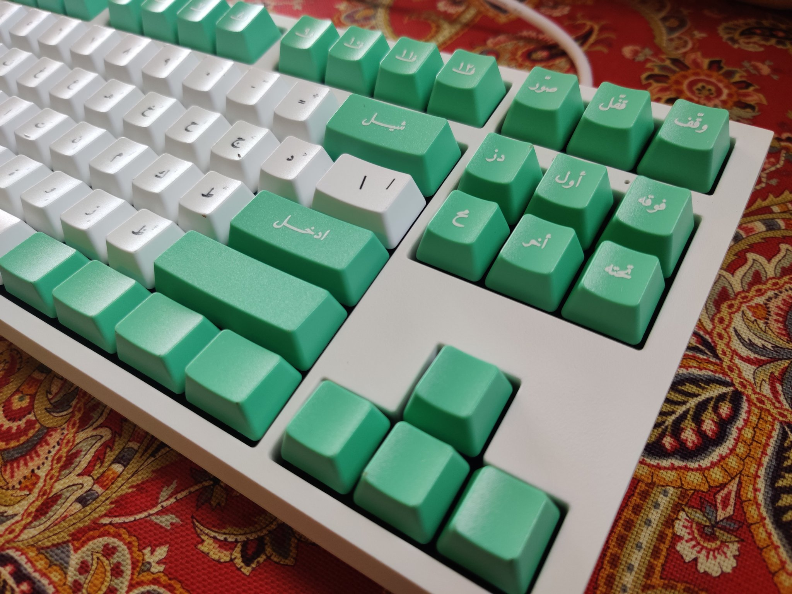

# arabic-keycaps
Monolingual Arabic keycap set design.

This is a simple keycap design that centers the Arabic alphabet. There currently exists no other keycaps, both mechanical and standard, that treats Arabic as a primary language (6/5/2020). 

My motivation behind creating this is that all existing "Arabic" keyboards are bilingual keyboards which center English as the primary language with Arabic frequently an afterthought. These assumptions presume knowledge of English and makes the use of computers difficult for people whose primary language isn't English for no particular reason. I'd go as far as saying that if someone needs a dual-language keyboard, it's much more likely that the non-English language is their mother tongue and should be centered by default. I got this idea after watching several elder relatives who communicate exclusively in Arabic strain their eyes to type a simple email.

## Design

Provided is a SVG file and Adobe Illustrator file each containing a set of vectors overlaid on top of a 104-key template. The font used is the wonderful [Amiri font](https://github.com/alif-type/amiri) in the Naskh style.

Yes, I took a few creative liberties with the translation of certain keys. This is not intended to be a direct MSA (فصحى) translation. It's meant to be a more jovial, Bahrani-centered translation. Feel free to fork and modify it with whatever translations you prefer.

## Production

I produced this with WASD Keyboards custom keycap sets. You upload the design and pick your font/key color schemas. It costs ~$40 at the time of writing and install on any standard Cherry MX switches. The material is ABS.

## Close ups

